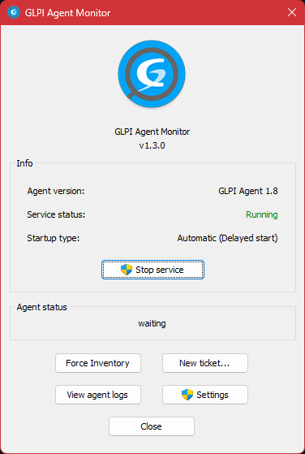

# GLPI Agent Monitor

## Description

GLPI Agent Monitor is a simple monitoring tool for GLPI Agent on Windows.

It sits on the system tray as the GLPI Agent logo. The logo changes color
from blue to red depending on the Agent status.
 - As of now, it will only go red if the Agent service is not running.

By default, the tool will start minimized to the system tray, but a
window will be opened if you left-click the icon.

## Features

Quickly see details such as:
 - Installed GLPI Agent version
 - Agent service status
 - Service startup type
 - Agent current status (from the /status page, updates every 2 sec.)

You can also:
  - Send a "Force inventory" request to the Agent
  - Go directly to the "New ticket" page on the configured GLPI server (with a screenshot automatically captured to the clipboard)
  - View the Agent logs (with the system default .log viewer)
  - Start, stop or resume the service

For future release features, read the [Changelog](CHANGES).

## Releases

Official releases are provided by the [glpi-project/glpi-agentmonitor](https://github.com/glpi-project/glpi-agentmonitor) fork.

## Available languages

 - English (US)
 - Portuguese (Brazil)
 - Italian (by [Kintaro Oe](https://github.com/kintaro1981))
 - French (by [Guillaume Bougard](https://github.com/g-bougard))
 - Russian (by [Fedorov Nikolay](https://github.com/kofe88))
 - Spanish (Uruguay) (by [Luis Giordano](https://github.com/Iruxos))
 - Dutch (by [Jeffrey Jansma](https://github.com/perplexityjeff))
 - Catalan (by [Bertu Garangou](https://github.com/bertugarangou))

If you want to translate the project to your language, feel free to fork the [development repository](https://github.com/redddcyclone/glpi-agentmonitor), insert a string table for your language in the `GLPI-AgentMonitor.rc` file (use Visual Studio) and open a pull request with your changes.

## Screenshots

## License

This software is licensed under the terms of GPLv2+, see LICENSE file for
details.
